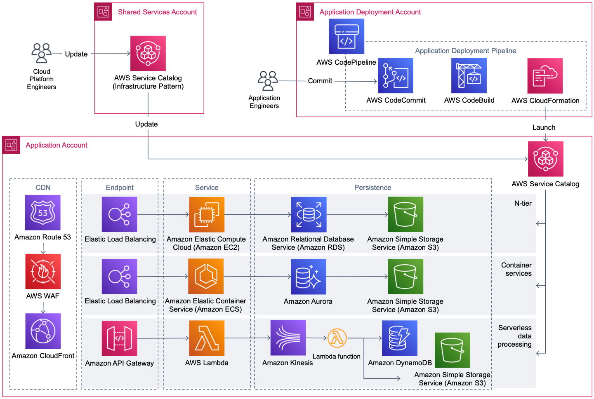

# AWS Cloud Practitioner Notes

Comprehensive study notes, diagrams, and resources covering the AWS Certified Cloud Practitioner certification.  
Organized to provide a clear reference for AWS core concepts, services, pricing models, security, and architectural best practices.

---

## 📜 Certification Overview
- **Certification**: AWS Certified Cloud Practitioner
- **Issued**: August 2025
- **Skills Covered**: AWS global infrastructure, core services, pricing models, security, and the AWS Well-Architected Framework.

---

## 📂 Table of Contents
1. [Core AWS Concepts](#core-aws-concepts)
2. [AWS Services by Category](#aws-services-by-category)
3. [Pricing & Billing](#pricing--billing)
4. [Security & Compliance](#security--compliance)
5. [Well-Architected Framework](#well-architected-framework)
6. [Diagrams & Visuals](#diagrams--visuals)
7. [Resources & Links](#resources--links)

---

## Core AWS Concepts
- **Cloud Computing Models**: IaaS, PaaS, SaaS — definitions and AWS examples.
- **Deployment Models**: Public, Private, Hybrid cloud.
- **AWS Regions & Availability Zones**: Global infrastructure organization and benefits.

---

## AWS Services by Category

### Compute
- **EC2**: Virtual servers in the cloud.
- **Lambda**: Serverless compute.
- **Elastic Beanstalk**: Simplified application deployment.

### Storage
- **S3**: Object storage.
- **EBS**: Block storage for EC2.
- **EFS**: File storage.

### Databases
- **RDS**: Managed relational databases.
- **DynamoDB**: NoSQL database.
- **Aurora**: High-performance relational DB compatible with MySQL/PostgreSQL.

### Networking
- **VPC**: Virtual network in AWS.
- **CloudFront**: Content Delivery Network.
- **Route 53**: DNS and domain name management.

---

## Pricing & Billing
- **CapEx vs OpEx**: Transition from capital expenses to operational expenses.
- **Pricing Models**: On-Demand, Reserved Instances, Spot Instances, Savings Plans.
- **Free Tier**: Services and usage limits available at no cost.

---

## Security & Compliance
- **Shared Responsibility Model**: AWS vs customer responsibilities.
- **IAM**: Identity & Access Management basics.
- **Security Groups & NACLs**: Network security controls.

---

## Well-Architected Framework
1. Operational Excellence
2. Security
3. Reliability
4. Performance Efficiency
5. Cost Optimization
6. Sustainability

---

## Diagrams & Visuals
Example AWS architecture diagram:

---

## Resources & Links
- [AWS Training & Certification](https://aws.amazon.com/training/)
- [AWS Well-Architected Framework](https://aws.amazon.com/architecture/well-architected/)
- [AWS Free Tier](https://aws.amazon.com/free/)

---

## 📝 Notes
This repository is for educational use and summarizes AWS concepts, services, and frameworks relevant to the AWS Certified Cloud Practitioner certification.
